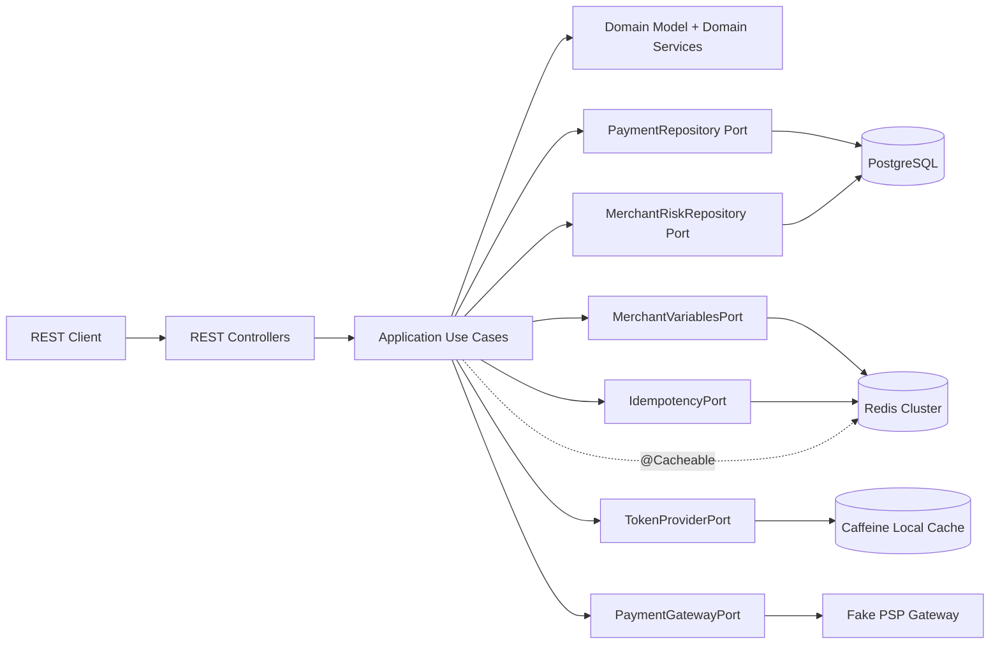

# Payment Processing Java 25 PoC

# Descripción de la funcionalidad

PoC de microservicio REST para **procesamiento de pagos** usando **Java 25**, **Spring Boot 4**, **Maven**, arquitectura **hexagonal**, principios **DDD**, **PostgreSQL**, **Redis Cluster** y **Caffeine**.

El flujo principal procesa un pago con idempotencia distribuida:

1. Recibe un request REST `POST /api/v1/payments`.
2. Registra la idempotencia en Redis Cluster.
3. Consulta el perfil de riesgo del comercio desde PostgreSQL y lo cachea con `@Cacheable` en Redis.
4. Lee variables dinámicas del comercio desde Redis Hash.
5. Genera o reutiliza un token PSP temporal en Caffeine local.
6. Autoriza contra un gateway simulado.
7. Persiste el resultado en PostgreSQL.
8. Retorna el detalle de cache usado en la respuesta para evidenciar Redis vs Caffeine.

# Diferencia entre Redis Cluster y Caffeine

Redis Cluster se usa como cache/estado **distribuido**:

- `@Cacheable` para consultas recurrentes de perfil de riesgo: `merchant-risk-profiles`.
- Variables dinámicas por merchant: `payment:variables:{merchantId}`.
- Idempotencia distribuida: `payment:idempotency:{merchantId}:{idempotencyKey}`.

Caffeine se usa como cache **local en memoria JVM**:

- Tokens PSP temporales tipo OAuth client credentials.
- TTL corto.
- No se comparte entre instancias.
- Ideal para datos efímeros y baratos de regenerar.

# Uso de cache

| Tecnología | Tipo de cache | Alcance | Uso principal |
|---|---|---|---|
| Redis Cluster | Cache distribuido | Compartido entre instancias | Consultas recurrentes, variables distribuidas e idempotencia |
| Caffeine | Cache local en memoria | Solo dentro de la JVM actual | Tokens temporales de autorización hacia el PSP/gateway |

## Implementación de Redis Cluster

En la PoC se usa Redis Cluster como cache distribuido. Redis se levanta con 6 nodos: 3 masters y 3 réplicas. La aplicación Spring Boot se conecta al cluster usando spring.data.redis.cluster.nodes.

Redis se usa para tres casos principales:

Cache distribuido con @Cacheable para el perfil de riesgo del merchant.
Variables distribuidas por merchant.
Idempotencia de pagos para evitar procesar dos veces el mismo request.

Cuando se consulta el perfil de riesgo por primera vez, la información se obtiene desde PostgreSQL y se guarda en Redis. En las siguientes consultas, el dato se responde desde Redis mientras el TTL siga vigente.

## Implementación de Caffeine

En la PoC se usa Caffeine como cache local en memoria dentro de la JVM. A diferencia de Redis, este cache no es distribuido y se pierde cuando se reinicia la aplicación.

Caffeine se usa para guardar temporalmente un token simulado del gateway de pagos o PSP. Cuando se procesa un pago nuevo, la aplicación busca el token en Caffeine. Si no existe, genera uno nuevo y lo guarda localmente. Si ya existe, lo reutiliza.

# Arquitectura



# Estructura del proyecto

```text
payment-processing-java25-poc/
├── pom.xml
├── README.md
├── src/
│   ├── main/
│   │   ├── java/com/edgarrt/poc/payments/
│   │   │   ├── domain/                 # Entidades, Value Objects, reglas DDD
│   │   │   ├── application/            # Casos de uso y puertos
│   │   │   └── infrastructure/         # Adaptadores REST, JPA, Redis y PSP
│   │   └── resources/
│   │       ├── application.yml
│   │       ├── application-docker.yml
│   │       └── db/migration/           # Flyway schema + seed
│   └── test/
└── infraestructura/
    ├── docker-compose.yml
    ├── docker/
    │   ├── app/Dockerfile
    │   └── postgres/Dockerfile
    ├── redis/redis-node.conf
    ├── scripts/
    ├── datasets/
    └── request-response/
```

# Código principal

# Dominio

- `Payment`: agregado principal. Controla transiciones `RECEIVED`, `AUTHORIZING`, `APPROVED`, `DECLINED`.
- `Money`, `MerchantId`, `CustomerId`, `PaymentId`: value objects.
- `PaymentRiskPolicy`: política de dominio para rechazar pagos por moneda, límite de ticket o riesgo.

# Aplicación

- `ProcessPaymentUseCase`: puerto de entrada del caso de uso.
- `ProcessPaymentService`: orquesta idempotencia, riesgo, variables, token PSP, autorización y persistencia.
- Puertos de salida: `PaymentRepository`, `MerchantRiskRepository`, `MerchantVariablesPort`, `IdempotencyPort`, `TokenProviderPort`, `PaymentGatewayPort`.

# Infraestructura

- REST: `PaymentController`, `MerchantController`, `CacheDiagnosticsController`.
- PostgreSQL/JPA: `PostgresPaymentRepositoryAdapter`, `PostgresMerchantRiskRepositoryAdapter`.
- Redis Cluster: `RedisIdempotencyAdapter`, `RedisMerchantVariablesAdapter`, `RedisCacheManager` para `@Cacheable`.
- Caffeine: `CaffeineGatewayTokenProvider` para tokens PSP efímeros.

# Requisitos

- JDK 25.
- Maven 3.9+.
- Docker + Docker Compose.

# Levantar infraestructura

Desde la raíz del proyecto:

```bash
cd infraestructura
docker compose up -d postgres redis-node-1 redis-node-2 redis-node-3 redis-node-4 redis-node-5 redis-node-6 redis-cluster-init
```

Validar cluster
```bash
docker exec -it redis-node-1 redis-cli -c -p 7000 cluster info
```


Redis Cluster anuncia nodos como `redis-node-1` a `redis-node-6`. Para ejecutar desde IntelliJ/host local, agrega aliases:

```bash
bash scripts/add-local-redis-hosts.sh
```

Luego carga variables en Redis:

```bash
bash datasets/redis/load-variables.sh
```

En caso de error, limpiar la data de los nodos de redis:

```bash
for port in 7000 7001 7002 7003 7004 7005; do
echo "Cleaning Redis node on port $port"
docker exec redis-node-1 redis-cli -c -h redis-node-1 -p "$port" --scan --pattern "*merchant-risk-profiles*" | \
xargs -r -I {} docker exec redis-node-1 redis-cli -c -h redis-node-1 -p "$port" DEL "{}"
done
```

# Ejecutar el proyecto localmente

Desde la raíz:

```bash
mvn clean spring-boot:run
```

# Ejecutar todo con Docker, incluyendo app

```bash
cd infraestructura
docker compose --profile app up -d --build
```

# Endpoints principales

# Procesar pago

```http
POST /api/v1/payments
Content-Type: application/json
```

```json
{
  "idempotencyKey": "idem-demo-merchant-001-0001",
  "merchantId": "merchant-001",
  "customerId": "customer-9001",
  "amount": 125.50,
  "currency": "PEN",
  "paymentMethod": {
    "type": "CARD",
    "token": "tok_card_demo_visa"
  }
}
```

# Consultar pago

```http
GET /api/v1/payments/{paymentId}
```

# Consultar perfil de riesgo con Redis @Cacheable

```http
GET /api/v1/merchants/{merchantId}/risk-profile
```
Valdiar key creada en redis:


Ejecuta este endpoint dos veces. La primera vez verás en logs:

```text
Cache miss: loading merchant risk profile from PostgreSQL
```

La segunda llamada debería responder desde Redis y no ejecutar ese log.

```bash
docker exec redis-node-1 redis-cli -c -p 7000 EXISTS "merchant-risk-profiles::merchant-001"
```

# Consultar / actualizar variables distribuidas en Redis

```http
GET /api/v1/merchants/{merchantId}/variables
```

```http
PUT /api/v1/merchants/{merchantId}/variables
{
"pspRoutingKey": "niubiz-primary",
"tokenAudience": "demo-card-gateway",
"maxAmountWithoutReview": "600.00",
"threeDsRequired": "true"
}
```


# Observar caches

```http
GET /api/v1/cache/observability
```

Retorna estado de Redis Cluster y estadísticas de Caffeine local.

# Validaciones de la PoC

# Idempotencia distribuida

1. Ejecuta `POST /api/v1/payments` con `idempotencyKey = idem-demo-merchant-001-0001`.
2. Repite el mismo request.
3. La segunda respuesta debe retornar:

```text
REPLAYED_FROM_REDIS_IDEMPOTENCY
```

# Redis @Cacheable

1. Ejecuta dos veces `GET /api/v1/merchants/merchant-001/risk-profile`.
2. Solo la primera llamada debe cargar desde PostgreSQL.
3. La segunda debe salir desde Redis Cluster.

# Caffeine local

1. Ejecuta dos pagos aprobados del mismo merchant con diferente idempotency key.
2. Consulta `GET /api/v1/cache/observability`.
3. Debes ver `estimatedSize > 0` en Caffeine.

# Limpiar todo

```bash
cd infraestructura
docker compose down -v --remove-orphans
```

# Notas

- Caffeine se usa solo para datos locales efímeros: tokens PSP temporales.